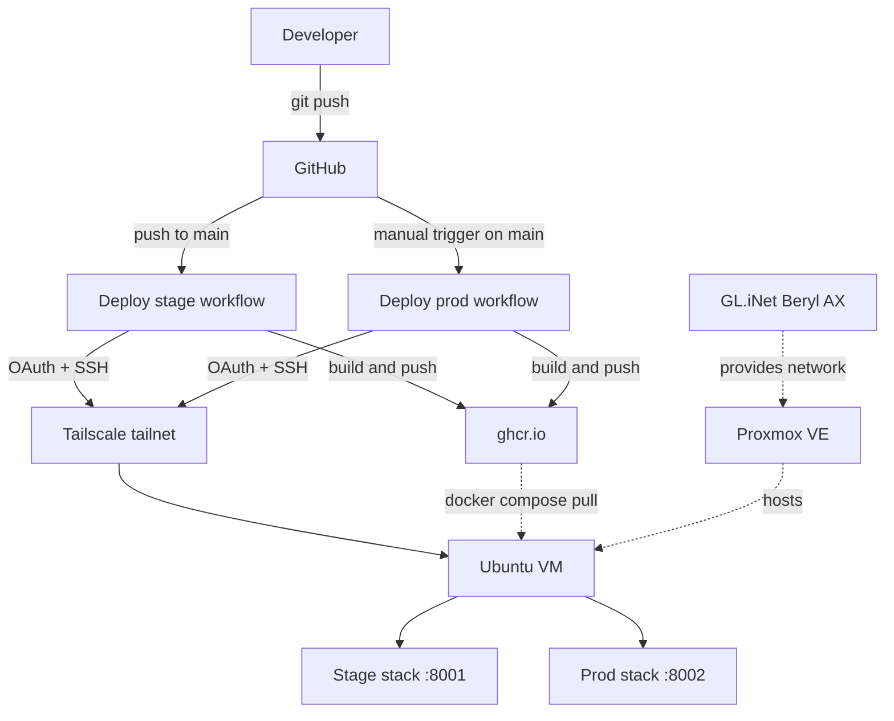

# homelab

A personal homelab platform for testing AI tools, building fun projects, and tinkering with infrastructure on owned hardware, while maintaining enterprise SDLC standards.

## Architecture



## Tech stack

| Layer          | Tools                                                          |
| -------------- | -------------------------------------------------------------- |
| Infrastructure | Proxmox VE, GL.iNet Beryl AX, Tailscale                        |
| Compute        | Ubuntu 25.04 VM, Docker, Docker Compose                        |
| Backend        | Python 3.12, FastAPI 0.110+, Pydantic 2+ (apps stateless by default) |
| Frontend       | Next.js 15 (App Router), TypeScript strict, Tailwind, shadcn/ui |
| Tooling        | Ruff 0.4+, mypy 1.10+ (strict), pytest 8+, hatchling, ESLint   |
| CI/CD          | GitHub Actions, GitHub Container Registry                      |

## Pipeline

1. Feature branch off `main`, push, open a PR. Per-app CI (e.g. [ynabInsights CI](.github/workflows/ynabinsights-ci.yml)) runs Ruff, mypy strict, and pytest on PRs that touch the app.
2. Merge into `main`. The app's stage deploy (e.g. [ynabInsights deploy stage](.github/workflows/ynabinsights-deploy-stage.yml)) fires automatically: build, push to ghcr.io, scp + ssh deploy over Tailscale, smoke-check `/health` on :8001. Stage is always whatever main is.
3. Promote to prod via the manual per-app prod deploy (e.g. [ynabInsights deploy prod](.github/workflows/ynabinsights-deploy-prod.yml)) from the Actions UI. Same flow, deploys to :8002.

Deploy mechanics are shared in the reusable [`deploy.yml`](.github/workflows/deploy.yml) (`workflow_call`); each app's deploy is a thin caller. Naming and namespacing rules are in [`docs/CONVENTIONS.md`](docs/CONVENTIONS.md).

Full design in [`docs/deployment.md`](docs/deployment.md).

## Hosted applications

### YNAB Insights

**Status:** Live. **URL:** [ynab.majed.fyi](https://ynab.majed.fyi)

An AI financial coach that lives alongside YNAB. Try the demo without signing up. Bring your own Anthropic or OpenAI key to use your real YNAB data. Zero persistence: keys and data never touch disk.

The app surfaces a feed of forward-looking cards (subscriptions, spending anomalies, cashflow forecasts, category projections, debt payoff, goal trajectories, category drift, year/quarter retrospectives). An agent (`Ask`) answers natural-language follow-ups via your provider's tool-use API. FastAPI + Next.js.

- Source: [`apps/finance/ynabInsights/`](apps/finance/ynabInsights/)
- Design notes: [`apps/finance/ynabInsights/DESIGN.md`](apps/finance/ynabInsights/DESIGN.md)
- Screenshots: [`apps/finance/ynabInsights/screenshots/`](apps/finance/ynabInsights/screenshots/)

## Repo structure

Monorepo. Apps live at `apps/<domain>/<app>/`, each a self-contained folder that owns its code, deploy manifests, and docs. Domain folders group related apps and hold no code themselves. Shared concerns live at the root. Naming and namespacing rules are in [`docs/CONVENTIONS.md`](docs/CONVENTIONS.md).

- [`apps/finance/`](apps/finance/): finance domain. Holds the [`ynabInsights`](apps/finance/ynabInsights/) app (YNAB Insights): FastAPI backend ([`app/`](apps/finance/ynabInsights/app/)), Next.js frontend ([`frontend/`](apps/finance/ynabInsights/frontend/)), tests, Dockerfiles, per-env compose ([`deploy/`](apps/finance/ynabInsights/deploy/)), design notes ([`DESIGN.md`](apps/finance/ynabInsights/DESIGN.md)).
- [`infra/`](infra/): shared, cross-app infrastructure (tunnel config and the like).
- [`docs/`](docs/): platform docs ([`deployment.md`](docs/deployment.md), [`CONVENTIONS.md`](docs/CONVENTIONS.md)).
- [`.github/workflows/`](.github/workflows/): per-app CI plus the reusable deploy workflow.

## Local development

```bash
git clone git@github.com:majedal01/homelab.git
cd homelab
cp apps/finance/ynabInsights/deploy/dev/.env.example apps/finance/ynabInsights/deploy/dev/.env
# Fill in optional YNAB_TOKEN, ANTHROPIC_API_KEY if you want sync/ask working.
docker compose -f apps/finance/ynabInsights/deploy/dev/docker-compose.yml up
```

Frontend at `http://localhost:3000`, FastAPI at `http://localhost:8000`. Both hot-reload on source changes. Deployment details in [`docs/deployment.md`](docs/deployment.md).
