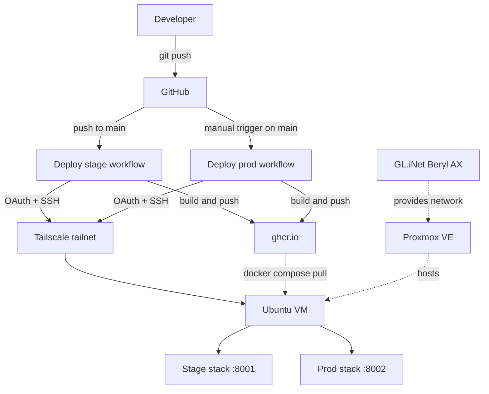

# homelab

A personal homelab platform built to practice enterprise software engineering patterns end to end on owned hardware.

## Architecture



## Tech stack

| Layer          | Tools                                                          |
| -------------- | -------------------------------------------------------------- |
| Infrastructure | Proxmox VE, GL.iNet Beryl AX, Tailscale                        |
| Compute        | Ubuntu 25.04 VM, Docker, Docker Compose                        |
| Backend        | Python 3.12, FastAPI 0.110+, Pydantic 2+, PostgreSQL 16        |
| Frontend       | Next.js 15 (App Router), TypeScript strict, Tailwind, shadcn/ui |
| Tooling        | Ruff 0.4+, mypy 1.10+ (strict), pytest 8+, hatchling, ESLint   |
| CI/CD          | GitHub Actions, GitHub Container Registry                      |

## Pipeline

1. Feature branch off `main`, push, open a PR. [CI](.github/workflows/ci.yml) runs Ruff, mypy strict, and pytest on every PR.
2. Merge into `main`. This auto-fires [the stage deploy](.github/workflows/deploy-stage.yml): build, push to ghcr.io, scp + ssh deploy to the VM over Tailscale, smoke-check `/health` on :8001. Stage is always whatever main is.
3. Promote to prod by manually triggering [the prod deploy](.github/workflows/deploy-prod.yml) from the Actions UI. Same flow as stage, deploys to :8002. The manual step is the intentional human gate before prod.

Full design in [`docs/deployment.md`](docs/deployment.md).

## Hosted applications

### YNAB Insights

**Status:** In progress.

An AI-augmented dashboard that pulls data from the YNAB budgeting API into a local Postgres store, with a Claude-powered agent that answers natural-language questions about spending. FastAPI backend, Next.js (App Router) frontend, Postgres store; agent uses Claude tool-use with typed Python tools hitting the local DB.

- Source: [`ynab_insights/`](ynab_insights/) (backend + frontend live together)
- Design notes: [`ynab_insights/DESIGN.md`](ynab_insights/DESIGN.md)
- Deployed URL: TBD

## Skills demonstrated

- Built a strict CI pipeline (Ruff lint and format, mypy strict, pytest) gating every PR; see [`ci.yml`](.github/workflows/ci.yml).
- Wired two-environment CD: stage deploys automatically on push, prod deploys via manual `workflow_dispatch` as an intentional gate. Both build versioned Docker images, push to ghcr.io, and roll the running container over SSH with a `/health` smoke check. See [`deploy-stage.yml`](.github/workflows/deploy-stage.yml) and [`deploy-prod.yml`](.github/workflows/deploy-prod.yml).
- Implemented zero-trust remote access by joining ephemeral CI runners to a Tailscale mesh with tag-based ACLs, so the VM never needs a public IP.
- Separated stage and prod into isolated compose stacks on the same host (own Postgres volume, own host port), so a stage outage cannot reach prod data.

## Platform roadmap

- Cloudflare Tunnel to expose select services on public URLs without opening firewall ports.
- Observability: Prometheus for metrics, Grafana for dashboards, Loki for log aggregation.
- Infrastructure as code: Terraform or OpenTofu to declare the VM, Tailscale ACLs, and Cloudflare resources.

Application-specific roadmaps live in each app's own folder.

## Repo structure

Monorepo. Platform-wide concerns (infra, CD, cross-cutting docs) live at the
root; everything specific to a hosted app lives inside that app's folder.

- [`ynab_insights/`](ynab_insights/): YNAB Insights app — FastAPI backend
  ([`ynab_insights/app/`](ynab_insights/app/)), Next.js frontend
  ([`ynab_insights/frontend/`](ynab_insights/frontend/)), tests, Dockerfiles,
  app-specific design notes ([`DESIGN.md`](ynab_insights/DESIGN.md)).
- [`infra/compose/`](infra/compose/): per-environment Docker Compose stacks
  (`dev`, `stage`, `prod`). Platform-level — knows how to assemble app
  containers into a deployable stack.
- [`docs/`](docs/): platform docs ([`deployment.md`](docs/deployment.md)).
  App-specific design notes live in their app folder.
- [`.github/workflows/`](.github/workflows/): CI and CD pipelines.

## Local development

```bash
git clone git@github.com:majedal01/homelab.git
cd homelab
cp infra/compose/dev/.env.example infra/compose/dev/.env
# fill in optional YNAB_TOKEN, ANTHROPIC_API_KEY if you want sync/ask working
docker compose -f infra/compose/dev/docker-compose.yml up
```

Frontend at `http://localhost:3000`, FastAPI at `http://localhost:8000`. Both
hot-reload on source changes. Deployment details in [`docs/deployment.md`](docs/deployment.md).
