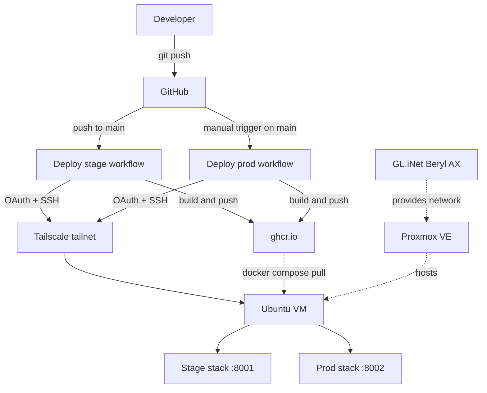

# homelab

A personal homelab platform built to practice enterprise software engineering patterns end to end on owned hardware.

## Architecture



## Tech stack

| Layer          | Tools                                                          |
| -------------- | -------------------------------------------------------------- |
| Infrastructure | Proxmox VE, GL.iNet Beryl AX, Tailscale                        |
| Compute        | Ubuntu 25.04 VM, Docker, Docker Compose                        |
| Application    | Python 3.12, FastAPI 0.110+, Pydantic 2+, PostgreSQL 16        |
| Tooling        | Ruff 0.4+, mypy 1.10+ (strict), pytest 8+, hatchling           |
| CI/CD          | GitHub Actions, GitHub Container Registry                      |

## Pipeline

1. Feature branch off `main`, push, open a PR. [CI](.github/workflows/ci.yml) runs Ruff, mypy strict, and pytest on every PR.
2. Merge into `main`. This auto-fires [the stage deploy](.github/workflows/deploy-stage.yml): build, push to ghcr.io, scp + ssh deploy to the VM over Tailscale, smoke-check `/health` on :8001. Stage is always whatever main is.
3. Promote to prod by manually triggering [the prod deploy](.github/workflows/deploy-prod.yml) from the Actions UI. Same flow as stage, deploys to :8002. The manual step is the intentional human gate before prod.

Full design in [`docs/deployment.md`](docs/deployment.md).

## Hosted applications

### YNAB Insights

**Status:** In progress.

An AI-augmented dashboard that pulls data from the YNAB budgeting API into a local Postgres store, with a Claude-powered agent that answers natural-language questions about spending. Currently scaffolded as a hello-world FastAPI service; real features are in development.

- Source: [`ynab_insights/`](ynab_insights/)
- Deployed URL: TBD

## Skills demonstrated

- Built a strict CI pipeline (Ruff lint and format, mypy strict, pytest) gating every PR; see [`ci.yml`](.github/workflows/ci.yml).
- Wired two-environment CD: stage deploys automatically on push, prod deploys via manual `workflow_dispatch` as an intentional gate. Both build versioned Docker images, push to ghcr.io, and roll the running container over SSH with a `/health` smoke check. See [`deploy-stage.yml`](.github/workflows/deploy-stage.yml) and [`deploy-prod.yml`](.github/workflows/deploy-prod.yml).
- Implemented zero-trust remote access by joining ephemeral CI runners to a Tailscale mesh with tag-based ACLs, so the VM never needs a public IP.
- Separated stage and prod into isolated compose stacks on the same host (own Postgres volume, own host port), so a stage outage cannot reach prod data.

## Platform roadmap

- Cloudflare Tunnel to expose select services on public URLs without opening firewall ports.
- Observability: Prometheus for metrics, Grafana for dashboards, Loki for log aggregation.
- Infrastructure as code: Terraform or OpenTofu to declare the VM, Tailscale ACLs, and Cloudflare resources.

Application-specific roadmaps live in each app's own folder.

## Repo structure

- [`ynab_insights/`](ynab_insights/): application code, tests, Dockerfile. One folder per hosted application.
- [`infra/`](infra/): Docker Compose stacks. Root `docker-compose.yml` is for local dev; per-environment stacks live under [`infra/compose/`](infra/compose/).
- [`docs/`](docs/): architecture and design notes.
- [`.github/workflows/`](.github/workflows/): CI and CD pipelines.

## Local development

```bash
git clone git@github.com:majedal01/homelab.git
cd homelab/infra
cp .env.example .env
# fill in real credentials
docker compose up
```

The app is available at `http://localhost:8000`. Deployment details in [`docs/deployment.md`](docs/deployment.md).
