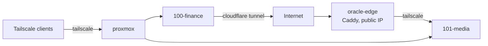

# network

Home is behind an ISP gateway with no bridge mode, then a GL.iNet Beryl AX that owns the
LAN. Inbound 443 from the internet never reaches the LAN, so public ingress runs through
the edge host instead. Everything else is reached over Tailscale.

| Tailnet node | What |
| --- | --- |
| proxmox | Proxmox host, subnet router for the LAN |
| 100-finance | personal-finance VM |
| 101-media | media VM |
| oracle-edge | public edge, reserved IP 163.192.213.34 |
| majood | workstation |

- DNS is on Cloudflare. `jellyfin` and `jellyseerr` A records point at the edge,
  unproxied so streams bypass the CDN. `ynab` goes through a Cloudflare Tunnel from the
  finance VM.
- GitHub Actions joins the tailnet with an OAuth client, tagged `tag:ci`, only for the
  length of a deploy.
- Two SSH keys: a personal one for root, and the deploy key used by CI as the `deploy`
  user on every VM. The Proxmox web UI is LAN-only.
